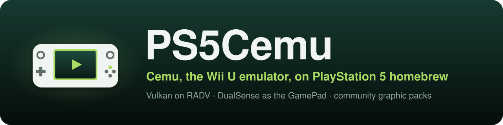

<p align="center">
  
</p>

<p align="center">
  <strong>Wii U and Nintendo 3DS emulation in one PlayStation 5 homebrew app</strong><br>
  Latest release: <a href="https://github.com/premohq/PS5CEMU-HAR/releases/latest"><strong>2.0.0 B</strong></a> ·
  <a href="https://github.com/premohq/PS5CEMU-HAR/raw/releases/PS5CEMU-HAR-v2.0.0b.zip">Download</a> ·
  <a href="#whats-new-in-200-b">What's new</a><br>
  <a href="#install">Install</a> · <a href="#wii-u-cemu">Wii U</a> · <a href="#nintendo-3ds-azahar">3DS</a> ·
  <a href="#controls">Controls</a> · <a href="docs/BUILDING.md">Building</a> · <a href="#credits">Credits</a>
</p>

**PS5CEMU-HAR** is a homebrew app for jailbroken PS5 consoles running etaHEN. It bundles two
emulators:

- [Cemu](https://github.com/cemu-project/Cemu) for Wii U games
- [Azahar](https://github.com/azahar-emu/azahar) for Nintendo 3DS games

Both use Vulkan through Mihawk's PS5 port of the RADV driver and are played with the DualSense. The
app opens on a start screen where you choose PS5 CEMU (Wii U) or PS5 AZAHAR (3DS), and each one has
its own launcher, game library, settings and in-game menu.

This is an unofficial project and is not affiliated with or endorsed by the Cemu or Azahar teams,
Nintendo or Sony. All credit for the emulators goes to their developers.

> [!NOTE]
> **Status:** most Wii U games I've tried are playable, with working video, controls, sound and
> saves. 3DS support is new since 2.0.0 and hasn't had much testing on real hardware yet, so expect
> some rough edges. If something goes wrong, please report it with your logs (see
> [Reporting problems](#reporting-problems)).

**New in 2.0.0 B:** Artic Base (play games from your own 3DS over the network), fixed 3DS sound,
a fix for a 3DS memory leak, and no more crashes from shared Breath of the Wild shader caches.
See [What's new in 2.0.0 B](#whats-new-in-200-b) for everything.

## Install

1. Download the latest release ZIP,
   [PS5CEMU-HAR-v2.0.0b.zip](https://github.com/premohq/PS5CEMU-HAR/raw/releases/PS5CEMU-HAR-v2.0.0b.zip)
   (see the [release page](https://github.com/premohq/PS5CEMU-HAR/releases/latest)), and extract it, or
   [build it yourself](docs/BUILDING.md).
2. Copy the `PPSA99360` folder to `/data/homebrew/PPSA99360` on your PS5.
3. Load etaHEN and add `PPSA99360` to its app jailbreak list. This gives the app access to `/data`
   and the JIT memory the emulators' recompilers need. Without it, the app runs its bundled
   `sandbox-elevator.elf` through elfldr instead, which only grants `/data` access, and Wii U games
   fall back to Cemu's interpreter, which is much slower.
4. Add your game dumps (see [Game files](#game-files)).
5. Launch PS5CEMU-HAR from the home screen, pick an emulator and open the Library.

**Updating:** copy the new `PPSA99360` folder over the old one. Everything in `/data/ps5cemu` is
kept. The PS5 keeps the app's name, icon and background from when it was first registered, so to
see new ones, register the app again in the loader you installed it with.

## Start screen and launchers

| Button | Action |
|---|---|
| Left / Right, Cross | Choose PS5 CEMU or PS5 AZAHAR |
| Circle (on a launcher's home screen) | Go back to the start screen |

The app opens on whichever side you used last. Both launchers have:

- **Continue Playing** and **Recently Played** on the home screen
- **Library**: all your games with their icons, plus box art from
  [GameTDB](https://www.gametdb.com/) when it's available (see [Box art](#box-art))
- **Settings**: video, audio, controls (remap any button by pressing it), game folder, installs and
  diagnostics
- **About**: credits and where the app stores its files

## Wii U (Cemu)

- Runs Cemu natively, with its x64 recompiler using the JIT memory etaHEN provides.
- Vulkan rendering at the PS5's 3840x2160 output, with a choice of upscaling filter (Bicubic by
  default) and 120 Hz on displays that support it.
- Plays WUA, WUD/WUX and unpacked games from any folder the PS5 can read.
- Comes with the Cemu community graphic packs, organized by folder like Cemu's Graphic Packs window,
  with a dropdown for each preset.
- Player 1's DualSense is the Wii U GamePad by default and other signed-in players get Pro
  Controllers, up to four players. Each player can be switched to a GamePad, Pro Controller, Classic
  Controller, or Wii Remote with or without a Nunchuk, with motion controls, rumble, stick deadzones
  and button mapping.
- Show the TV or the GamePad screen as the main picture, with the other one in a corner if you want.
- The touchpad works as the GamePad's touch screen, with an on-screen cursor.
- Install updates and DLC to the emulated Wii U storage from **Settings > Install updates and
  DLC**. Updates and DLC already in your game folder or inside a WUA are picked up automatically.
- Text entry with Cemu's on-screen keyboard, using the D-pad or the touchpad.

## Nintendo 3DS (Azahar)

- Based on Mihawk's PS5 build of Azahar, with dynarmic's ARM recompiler running in executable
  memory.
- Vulkan rendering at 1x to 10x internal resolution (6x, or 2400x1440, by default), texture filters
  (Anime4K, Bicubic, ScaleForce, xBRZ, MMPX), and shaders compiled in the background so games don't
  slow down.
- Screen layouts: a large top screen with the bottom one beside it, the top screen only, side by
  side, or stacked. Either screen can take the main spot.
- DualSense mapping: A on Circle and B on Cross like a real 3DS (or swapped), circle pad on the left
  stick, C-stick on the right stick, ZL/ZR on L2/R2, and the gyro and accelerometer for motion
  controls. Every button can be remapped in **Settings > Controls**. A New 3DS is emulated.
- The touchpad is the bottom screen: move your finger to move the cursor, click to tap, and hold the
  click to drag.
- Install CIA files (games, updates and DLC) to the emulated SD card from **Settings > Install CIA
  files**. Installed games and demos show up in the library.
- **Artic Base:** play a game straight from your own 3DS over the network. Start the Artic Base app
  on the 3DS, then choose **Artic Base** on the 3DS home screen (or press Triangle), enter the
  address the 3DS shows and connect. The same page runs the Artic Setup Tool, which copies your
  3DS's system files into Azahar.
- Sound through the PS5's audio output, resampled from the 3DS's 32,728 Hz to 48 kHz.
- A CPU clock setting in the in-game menu (100% by default): lower can bring a slow game up to full
  speed.

## Game files

### Wii U

Put games in `/data/ps5cemu/games`, or pick another folder in **Settings > Game files**.

```text
<game folder>/
├── Game.wua                        # Wii U archive: game, update and DLC in one file
├── Game.wux                        # or Game.wud
└── Game/                           # unpacked game
    ├── code/
    ├── content/
    └── meta/
```

Encrypted WUD and WUX dumps also need their disc keys in `/data/ps5cemu/keys.txt`.

### Nintendo 3DS

Put games in `/data/ps5cemu/azahar/games`, or pick another folder on the 3DS side.

- `.3ds`, `.cci`, `.cxi` and `.app` dumps, `.3dsx` and `.elf` homebrew, and Azahar's compressed
  formats (`.z3ds`, `.zcci`, `.zcxi`, `.z3dsx`) can be played directly.
- `.cia` files have to be installed first from **Settings > Install CIA files**, then the game shows
  up in the library. Update and DLC CIAs are installed the same way. Azahar only installs decrypted
  CIA files.
- Encrypted dumps need `aes_keys.txt` from your own console in `/data/ps5cemu/azahar/sysdata`.
  Decrypted dumps don't need any keys.

No games, keys, firmware or other copyrighted console data are included. Dump them from hardware and
software you own, and don't download or share them.

## Box art

The first time a game shows up in a library, the app downloads its cover from GameTDB
(`art.gametdb.com`) using the ID printed on the game's box, for example `ALZE01` for Breath of the
Wild or `AREE` for Super Mario 3D Land. Covers are downloaded in the background over plain HTTP, one
game at a time, and saved in `/data/ps5cemu/covers/boxart`. If GameTDB doesn't have a cover, the app
saves a `.none` file there and won't ask again; delete that file to try again. Without an internet
connection, the libraries just show the game icons.

## Controls

| In a Wii U game | Action |
|---|---|
| Touchpad | GamePad touch screen cursor: click to tap, hold the click to drag |
| Touchpad click + Options | Open the in-game menu |
| Touchpad click + L1 | Switch the main screen between TV and GamePad |
| Touchpad click + R1 | Show or hide the second screen in the corner |

| In a 3DS game | Action |
|---|---|
| Touchpad | Bottom screen cursor: click to tap, hold the click to drag |
| Touchpad click + Options | Open the in-game menu |
| Touchpad click + L1 | Swap the screens |
| Touchpad click + R1 | Next screen layout |

In the in-game menu, use the D-pad to move, Cross to select, Left/Right to change a setting and
Circle to go back to the game. From there you can change the screens, picture, volume and controls,
turn on a performance overlay, or go back to the library (press Cross twice; unsaved progress is
lost). Your changes are saved for the next games you play. The Wii U menu also has Cemu's
**Accurate barriers** setting (on by default; off can be faster but some games flicker), and the
3DS menu has the **CPU clock**.

## Where files are stored

Everything the app writes goes to `/data/ps5cemu`, except your game files:

```text
/data/ps5cemu/
├── ps5cemu.json                    launcher settings
├── settings.xml                    Cemu settings
├── controllerProfiles/             Cemu controller profiles
├── mlc01/                          Wii U storage: installed updates and DLC, saves
├── games/                          default Wii U game folder
├── keys.txt                        disc keys for encrypted Wii U dumps
├── graphicPacks/                   community graphic packs and your own
├── cache/                          Cemu shader and pipeline caches
├── azahar/
│   ├── games/                      default 3DS game folder
│   ├── sdmc/                       3DS SD card: installed CIAs, saves, extra data
│   ├── nand/                       3DS system storage
│   ├── sysdata/                    aes_keys.txt, if you add it
│   ├── shaders/                    Azahar shader cache
│   └── log/azahar_log.txt          Azahar log
├── covers/                         game icons and box art (boxart/)
├── log.txt                         Cemu log
└── logs/boot.log                   app log (boot.prev.log is the previous session)
```

**Moving Wii U saves from Cemu on PC:** with the game closed, copy the save folder from
`mlc01/usr/save/00050000/<title ID>/user/<account>` on your PC to
`/data/ps5cemu/mlc01/usr/save/00050000/<title ID>/user/80000001`.

**Moving 3DS saves from Azahar or Citra on PC:** copy
`sdmc/Nintendo 3DS/<ID0>/<ID1>/title/00040000/<title ID>/data` to the same path under
`/data/ps5cemu/azahar/sdmc/Nintendo 3DS/`. In Azahar, ID0 and ID1 are all zeros on both PC and PS5.

## Reporting problems

**Settings > Diagnostics** shows the app version and where the logs are. When you report a problem,
please attach `/data/ps5cemu/logs/boot.log`, plus `log.txt` (Wii U) or `azahar/log/azahar_log.txt`
(3DS). During a game, the boot log also gets a `[memory]` line once a minute, which shows whether
memory use keeps growing, and a `[perf]` (Wii U) or `[perf3ds]` (3DS) line every 10 seconds with the
frame rate. If Cemu crashes, its crash report is in the boot log too, as `[crash]` lines.

## What's new in 2.0.0 B

- **3DS sound fixed.** Azahar's sound was played at the wrong rate, about half again too high and
  warbling. It's now resampled from the 3DS's 32,728 Hz to the PS5's 48 kHz, and the sound thread
  runs at a higher priority so busy moments don't make it crackle.
- **3DS memory leak fixed.** Every time a game opened a system applet (the keyboard, an error
  screen), Azahar kept that applet's recompiled code for good, up to 128 MiB per CPU core each time.
  It's now freed when the applet closes.
- **Artic Base.** Play games from your own 3DS over the network, or copy its system files with the
  Artic Setup Tool (see [Nintendo 3DS](#nintendo-3ds-azahar)).
- **CIA installs:** clearer messages (Azahar only installs decrypted CIA files), and installed demos
  now show up in the library.
- **3DS in-game menu:** the button you close the menu with no longer reaches the game, and there's
  a new CPU clock setting.
- **Wii U shader caches from another Cemu no longer crash the game.** Breath of the Wild ended while
  loading a shared cache, because a few entries were in a form this Cemu can't read. Those entries
  are now dropped (and compiled again when the game needs them) instead of stopping the game.
- **Wii U in-game menu:** Cemu's Accurate barriers setting, on by default as in Cemu.
- **Better logs:** frame-rate lines for both emulators, a 3DS frame-time breakdown in the
  performance overlay, shader cache loading progress, and Cemu crash reports in the boot log.
- Wii U performance is unchanged unless you turn Accurate barriers off.

**Older releases**

- **2.0.0:** added Azahar for 3DS games, a start screen to choose Wii U or 3DS, game icons and box
  art, per-player controls in the in-game menu, and memory leak fixes.
- **1.0.0:** dark blue launcher, graphic pack presets, controller settings, and update and DLC
  installs.
- **0.2.0:** games run at the right speed, GamePad screen options, touchpad cursor, in-game menu and
  on-screen keyboard.
- **0.1.0:** first version that ran on a PS5.

## Known issues

- Going back to the library restarts the app, and the game keeps running behind the in-game menu.
- 3DS camera, microphone, local wireless and online play aren't supported.
- A CIA install can't be canceled once it starts.
- Texture filters on the 3DS side are expensive at high internal resolutions; if a game stutters,
  try Texture filter: None first.
- The first start with a large Wii U shader cache takes a few minutes while Cemu builds the
  pipelines.
- There's no option yet to turn off box art downloads.
- DualSense motion controls haven't been tested with every game.

## Building

Run `make release` on Linux (Ubuntu 24.04; WSL works too). It downloads every dependency at its
pinned version, builds Azahar, Cemu and the launcher, and writes the app to `build/app/PPSA99360` and
a ZIP to `dist/`. See [docs/BUILDING.md](docs/BUILDING.md) for details, or run `make help` for the
other targets.

What's in the repo:

- `port/`: the PS5 platform layer, both emulators' PS5 frontends, the launcher and the in-game menus
- `patches/`: changes to Cemu and Azahar
- `tools/`: build, packaging and artwork scripts
- `extras/ps5mfr`: Alex Free's
  [PS5 Make FSELF Recursive](https://github.com/alex-free/ps5-make-fself-recursive), with its own
  readme and license

## Credits

- [Cemu](https://github.com/cemu-project/Cemu) by the Cemu team and contributors (MPL-2.0)
- [Azahar](https://github.com/azahar-emu/azahar) by the Azahar team and the Citra contributors
  before them (GPL-2.0-or-later), with dynarmic by MerryMage and contributors
- **Mihawk** for RADV on PS5 ([PS5_Mesa](https://github.com/mihawk-99/PS5_Mesa),
  [PS5_Vulkan](https://github.com/mihawk-99/PS5_Vulkan), the payload SDK fork and its platform layer)
  and the PS5 ports of Azahar and dynarmic ([PS5_Azahar](https://github.com/mihawk-99/PS5_Azahar)),
  with contributions from **mpereiraesaa**
- **BlackBearReloaded** for [ProsperoEden](https://github.com/blackbearreloaded/ProsperoEden), which
  the launchers' design, artwork, fonts and software renderer are based on, and the
  [PS5 Native App Boilerplate](https://github.com/blackbearreloaded/ps5-native-app-boilerplate) for
  the app runtime, packaging and sandbox elevation
- **Dimok** for the Wii U Homebrew Launcher, whose background is used on the Wii U side
- The authors of the **3DS Homebrew Launcher**, which inspired the 3DS side's background
- **John Törnblom** for the [PS5 Payload SDK](https://github.com/ps5-payload-dev/sdk), and
  **pacbrew** for their PS5 libraries
- **Swordpdf** for the etaHEN jailbreak request from PS5SX2
- [GameTDB](https://www.gametdb.com/) and its contributors for the box art
- The authors of the [Cemu community graphic packs](https://github.com/cemu-project/cemu_graphic_packs)

## License

The app's own code is licensed under GPL-3.0-or-later (see [LICENSE](LICENSE)). Files derived from
Cemu keep Cemu's MPL-2.0 license, as noted in their headers. Azahar is GPL-2.0-or-later, and the app
that includes it is distributed under GPL-3.0-or-later. Other third-party components keep their own
licenses.

## Disclaimer

- **No affiliation.** This is an independent homebrew project. It is not affiliated with, endorsed
  by, or sponsored by Sony Interactive Entertainment, Nintendo, the Cemu project or the Azahar
  project. "PlayStation" and "PS5" are trademarks of Sony Interactive Entertainment Inc.; "Wii U" and
  "Nintendo 3DS" are trademarks of Nintendo.
- **No proprietary material.** No Sony or Nintendo SDK, firmware, encryption keys, games or
  decrypted system modules are included.
- **No warranty.** This project is provided "as is", without warranty of any kind, to the extent
  permitted by law. See sections 15 and 16 of the GPL.
- **Use at your own risk.** Running homebrew requires a modified console, which may void its
  warranty, breach the platform's terms of service, or cause data loss.
- **Legal use only.** Only use it with hardware, accounts and content you own. This project does not
  support or enable piracy.
